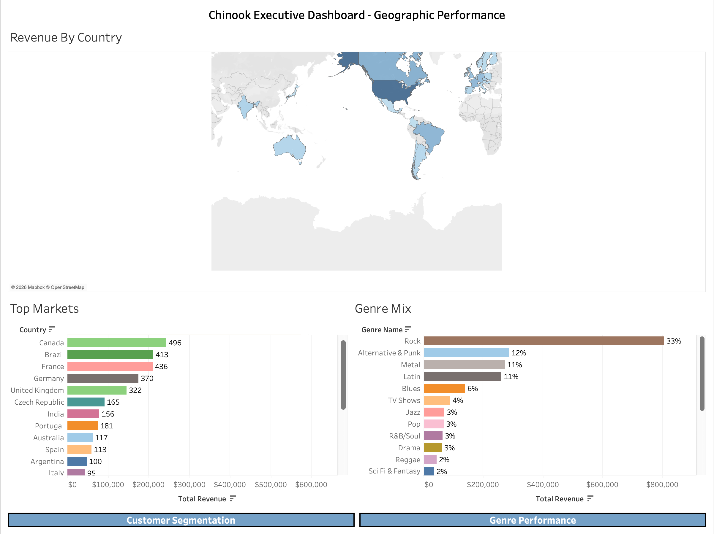
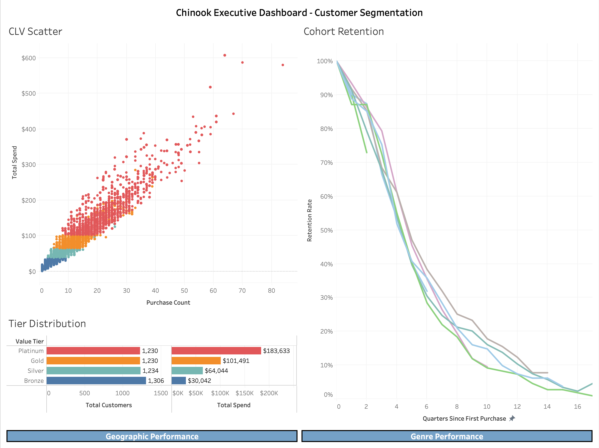
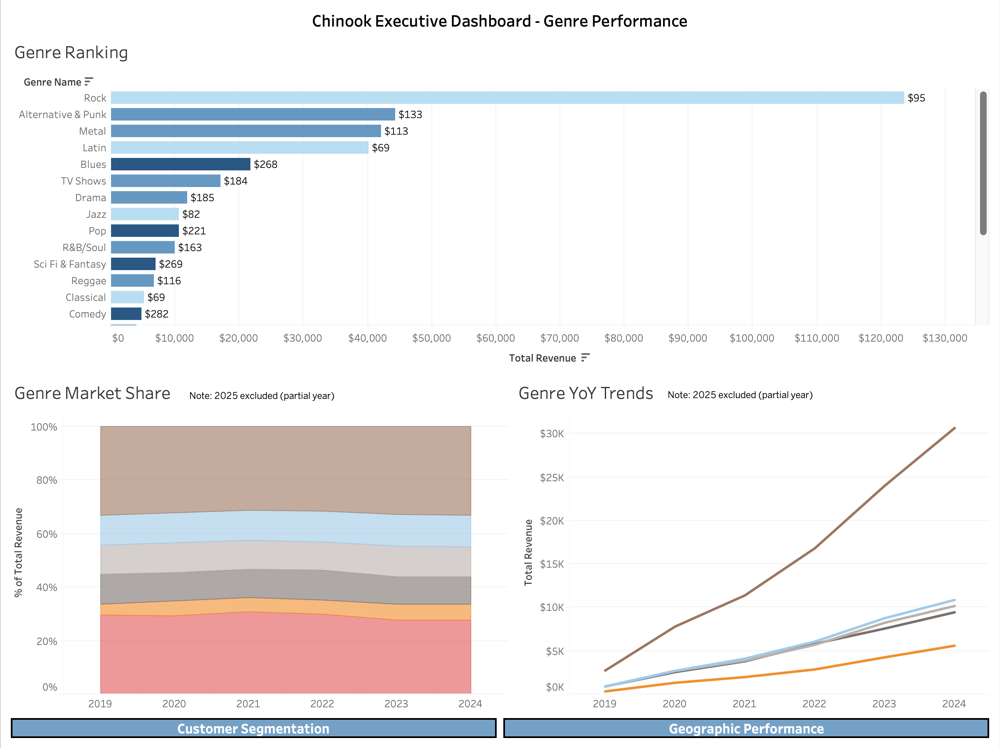

# Tableau Dashboard Walkthrough
**Chinook Executive Dashboards**

[Open the live dashboard on Tableau Public](https://public.tableau.com/app/profile/daniel.matel.okoh/viz/ChinookExecutiveDashboards/GeographicPerformance)

---

## What the Dashboards Are For

The SQL case studies answered specific questions: which countries drive revenue, how customers segment by lifetime value, and which genres over- or under-perform their catalog size. The Python case study went deeper into purchase timing, seasonality, and whether customers stick around. But the output of each analysis was a table or a chart in a notebook. None of it was something you could hand to a marketing director and say "here, explore this yourself."

The Tableau dashboards take the key findings from every prior phase and put them into one interactive tool where a stakeholder can filter, compare, and drill down without touching a query or a notebook.

---

## The Three Views

### View 1: Geographic Performance

**What it shows:** Country-level revenue distribution, the top markets ranked by total spend, and the genre mix within each country.

**Why it exists:** SQL Case Study 1 found that the top 5 countries account for a disproportionate share of total revenue. That finding is useful on its own, but the natural follow-up is "what are people buying in those markets?" This view answers that. Click a country on the map, and the genre breakdown updates to show what's selling there.

**How it connects:**
- The revenue map and top markets chart directly visualize the geographic concentration from CS1
- The genre mix panel bridges CS1 (geography) and CS3 (genre benchmarking) by showing which genres dominate in which markets
- A marketing team could use this view to decide where to run a campaign and what content to promote in that region

**Key interactions:** Click any country on the map or any bar in the top markets chart to filter the genre mix panel.

---

### View 2: Customer Segmentation

**What it shows:** How customers distribute across value tiers (Bronze, Silver, Gold, Platinum), a scatter plot of individual customer lifetime value vs. purchase count, and cohort retention curves by signup year.

**Why it exists:** SQL Case Study 2 built the CLV tiers and found that 72% of revenue sits in a single tier because the price points are too close together. The Python case study (Part 3) measured whether customers actually come back after their first purchase. This view combines both into one place so you can see the tier distribution, spot individual high-value customers, and check whether retention patterns differ by cohort.

**How it connects:**
- The tier distribution chart comes directly from the CASE WHEN segmentation in CS2
- The CLV scatter lets you identify outliers that the aggregate numbers hide
- The retention curves are the Tableau equivalent of the Python cohort analysis (Part 3), giving stakeholders an interactive version of the matplotlib output
- Together, these three components answer: "Who are our best customers, and do they stay?"

**Key interactions:** Click a tier in the distribution chart to filter the scatter plot down to just that segment. Hover over individual dots in the scatter to see specific customer details.

---

### View 3: Genre Performance

**What it shows:** All 25 genres ranked by revenue with catalog efficiency encoded as color, year-over-year revenue trends for the top 5 genres, and market share over time as a stacked area chart.

**Why it exists:** SQL Case Study 3 calculated which genres generate more (or less) revenue than their catalog size would predict. But a static table of 25 genres is hard to scan. This view makes the comparison visual: long bars with warm colors mean high revenue and high efficiency; short bars with cool colors mean the genre has catalog space but isn't earning proportionally. The YoY trend lines show whether top genres are growing or flattening, and the market share chart shows whether the genre mix is shifting over time.

**How it connects:**
- The genre ranking bar chart is a direct visualization of the benchmarking CTE from CS3
- Catalog efficiency (revenue per catalog track) is encoded as color, making the over/under-performers immediately visible
- The YoY trend lines pick up a thread from the Python case study (Part 2), which tested for seasonal patterns and growth deceleration at the aggregate level. Here, that same question plays out at the genre level
- The market share chart shows concentration risk: if one genre dominates and starts declining, it matters more than if a small genre fluctuates

**Key interactions:** Click any genre in the ranking chart to filter the YoY trend and market share views to that genre. The top 5 genres are pre-filtered in the trend chart; click the ranking to swap in a different genre.

---

## Cross-Filtering Across Views

Each dashboard is self-contained, but they share the same underlying data. Navigation buttons at the top of each view link to the other two, so a stakeholder can move from "where is the revenue?" (Geographic) to "who's spending it?" (Customer Segmentation) to "what are they buying?" (Genre Performance) without leaving the tool.

The filter actions are designed so that clicking one chart updates the others on the same dashboard. This means you can answer compound questions in a few clicks: "In our top market, what genre dominates?" or "Among Gold-tier customers, does retention hold up?" or "Is our top genre's growth decelerating?"

---

## A Note on Embedding

GitHub's markdown renderer strips out iframes and embedded HTML for security reasons, so the interactive dashboard can't be embedded directly in this page. The link at the top opens it on Tableau Public, where all three views are fully interactive.

If you'd prefer a live embedded version, the repo could be extended with GitHub Pages to host the Tableau embed code. For now, the link is the most reliable way to access it.
