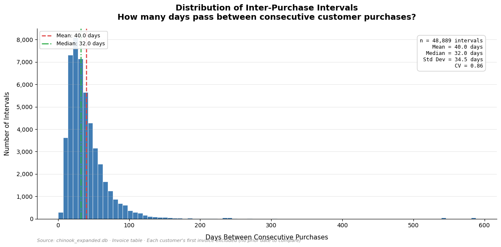
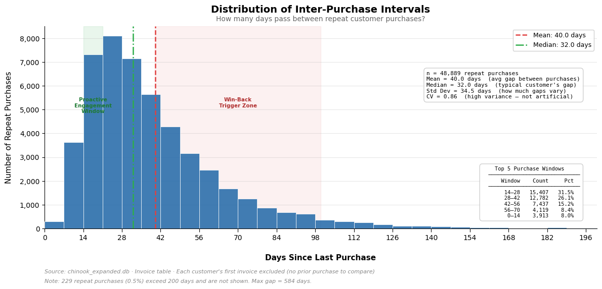

# Case Study 1: Is the Purchase Pattern Real?
## Purchase Timing & Frequency Analysis

---

## The Business Question

SQL Case Study 2 segmented customers by lifetime value and found something unexpected: almost every customer in the original Chinook database made exactly 7 purchases. In a customer base spanning 24 countries with different buying habits, that kind of uniformity doesn't happen organically.

I flagged three possible explanations in that case study: the purchase dates are clustered around external events (a sale, a release, a promotional push), there's a seasonal pattern driving consistent behavior, or it's a data artifact — a byproduct of how the sample database was generated rather than a reflection of real customer behavior.

SQL couldn't answer that question. A COUNT of purchases per customer tells you *how many* — not *when* or *how spread out*. To investigate timing, I needed datetime operations, rolling calculations, and visualizations that SQL alone doesn't support well.

That's what this notebook does. Using an expanded version of the Chinook database (~5,000 customers, ~54,000 invoices, 2019–2025), I'm testing whether purchase frequency looks organic, seasonal, or artificial. The expanded data is synthetic — I built it to have realistic variance, seasonality, and churn patterns, not uniform behavior — so the question isn't whether the data is "real" but whether the analytical framework would hold up against real data. The core deliverables:

- **Inter-purchase interval analysis** — how many days pass between consecutive purchases, and what does the distribution look like?
- **Purchase date scatter plot** — are there visible clusters in when customers buy?
- **Monthly revenue time series** — does revenue follow seasonal patterns or stay flat?
- **Cohort retention analysis** — do customers stick around, or do they drop off after a predictable number of purchases?

If the pattern is organic, the distribution should be right-skewed with natural variance — not a tight cluster around a single number. If it's seasonal, we should see spikes aligned with calendar events. If it's artificial, we'll see suspicious uniformity that no real customer base would produce.

The answer shapes how a marketing team thinks about re-engagement timing, campaign cadence, and churn prediction.

---

## The Prompt I Gave the AI

Using the structured prompt framework from the SQL case studies, my starting message in a fresh AI session was:

> *"Can you help me create a technical prompt for Python built on this framework: Persona, Task, Context, Constraints, Format, Reference, Audience, Evaluate. The business question I want to answer is 'is customer purchase frequency organic, seasonal, or a data artifact?' I'm working with an expanded synthetic version of the Chinook database that has ~5,000 customers and invoices spanning several years."*

I uploaded my SQL Case Study 2 write-up as a reference file, along with an example prompt from the prior case study, so the AI had context on the business question and the level of analytical depth I'm working at.

The prompt the AI helped me build:

---

**Persona**
> Act as a senior data analyst who writes clean, well-commented Python code for business stakeholders. Code should be readable in a Jupyter notebook — not just functional, but structured so a non-technical reviewer can follow the logic.

**Task**
> Write Python code that pulls all invoice dates per customer from the database, calculates the inter-purchase interval (days between consecutive purchases) for each customer, and plots a frequency histogram showing the distribution of those intervals. Include summary statistics (mean, median, standard deviation) printed alongside the chart.

**Context**
> I'm working with a SQLite database called `chinook_expanded.db` — an expanded version of the Chinook database with ~5,000 customers and invoices spanning several years. The relevant table is Invoice (columns: InvoiceId, CustomerId, InvoiceDate, Total). I'm using pandas, matplotlib, and sqlite3.
>
> I've attached the SQL Case Study this analysis builds on. That case study found suspiciously uniform purchase frequency across the original customer base and flagged three possibilities: the dates are clustered around external events, there's a seasonal pattern, or it's a data artifact. This Python analysis is the follow-up investigation.

**Constraints**
> - Use `pd.read_sql()` to pull data
> - Calculate intervals using pandas `groupby` and `shift`, not SQL window functions
> - Drop each customer's first invoice from the interval calculation (no previous date to compare against)

**Format**
> Structure for a Jupyter notebook: markdown headers explaining each step, then the code, then the output. Follow clean visualization standards: title, axis labels, and a source note. Comments should explain *why*, not just *what*. Use descriptive variable names.

**References**
> Use the attached SQL Case Study 2 write-up and example prompt as style guides — match the analytical depth and business framing, not just the technical output.

**Audience**
> The output will be reviewed by a non-technical marketing director and their team. Column names, chart labels, and any printed summaries should be immediately understandable without a technical background.

**Evaluate**
> I'll check the first draft for: correct interval calculation (first invoice excluded, no off-by-one errors), a histogram that reveals the shape of the distribution, and whether the output actually helps answer the question — does this look organic, seasonal, or artificial?

---

## The AI's Raw Output (V1)

The V1 code was structurally sound — the SQL query, the groupby-shift interval calculation, the histogram, and the summary statistics all worked correctly on the first pass. The AI also included a useful interpretation table at the end mapping distribution shapes to their meanings (single spike → artificial, right-skewed → organic, etc.), which I kept.

One notable improvement over the SQL case studies: when I asked the AI for the top 5 verification checks, it returned them as executable Python code rather than a manual checklist. In SQL, verification was a separate pass I ran after the analysis was done. In Python, the verification checks run automatically as part of the pipeline — if the math is wrong, the script tells you before you ever see a chart. I restructured the notebook to run verification *before* the summary statistics and histogram, because if the numbers are wrong, evaluating what they mean is pointless.

**Process update:** In the SQL case studies, verification came after the critical evaluation. For Python, I moved it before — the tool makes automated verification possible, so the workflow should take advantage of that. Verify first, then evaluate.

*The full V1 code and output are in the Jupyter notebook. The verification checks (row count reconciliation, negative/zero interval check, single-customer spot-check, distribution tail sanity, histogram completeness) all passed.*

---

## Verification Pass

Before evaluating the chart or drawing any conclusions, the verification checks confirmed the data pipeline is correct. Five checks, all passed:

**✅ Check 1 — Row count reconciliation**
> 53,809 invoices − 4,920 first invoices = 48,889 expected intervals. Output: 48,889. Match confirmed.

**✅ Check 2 — No negative intervals**
> Zero negative intervals found. Sort order and groupby boundaries are clean.

**✅ Check 3 — Spot-check one customer end-to-end**
> Pulled a random customer's raw invoice dates, calculated gaps manually using an independent method (Series.diff()), and compared to the script's output. Exact match.

**✅ Check 4 — Distribution tails reasonable**
> Max interval: 584 days (~19 months). Within plausible range for a lapsed customer. No values exceeding 1,500 days.

**✅ Check 5 — Histogram completeness**
> Sum of all histogram bars = 48,889. Matches total interval count. No data silently dropped by bin edges.

**Verdict:** Numbers are mathematically correct. Proceed to evaluation with confidence.

---

## My Critical Evaluation

The V1 output ran correctly — the verification checks confirmed the interval calculation, the histogram renders, and the summary stats are accurate. But after reviewing the chart and the numbers, I had several issues to address before this would be presentable to a non-technical audience.

**1. The x-axis distorts the story**

The histogram extends to 600 days because one customer had a 584-day gap between purchases. That extreme tail compresses the meaningful part of the distribution — the 0–150 day range where virtually all the action is — into the left third of the chart. A marketing director looking at this would see a spike on the left and empty space on the right, not a clear purchasing pattern.

The fix: cap the display at ~200 days and note how many intervals fall beyond that cutoff. The outliers aren't wrong data — they're just not where the insight lives.

**2. The summary stats box isn't audience-appropriate**

The stats box includes "CV = 0.86" and "Std Dev = 34.5 days" without explaining what those mean. A marketing director making campaign decisions almost certainly doesn't care about coefficient of variation without context. If a metric needs a footnote to be useful, it probably shouldn't be on the chart without one.

The fix: keep all metrics on the chart but add plain-language parenthetical explanations — "Std Dev = 34.5 days (how much gaps vary)" and "CV = 0.86 (high variance — not artificial)." The reader sees the number and immediately understands what it means.

**3. The legend covers the data**

The mean and median legend sits in the upper left — directly over the peak of the distribution, which is the most important part of the chart. It should move to the upper right or outside the plot area so nothing blocks the shape of the data.

**4. The subtitle competes with the title**

"How many days pass between consecutive customer purchases?" is in the same bold weight as the main title. It should be visually subordinate — smaller font, lighter weight — so the eye reads the title first and the subtitle as supporting context.

**5. The x-axis labels need more granularity**

The tick marks don't clearly show regular intervals, which makes it hard to read specific values off the chart. A marketing team reasoning about "every 2 weeks" or "every 30 days" needs to be able to see those markers clearly. 14-day tick intervals map to how marketers actually think about campaign cadence.

**6. The labels speak analyst, not marketer**

"Number of Intervals" and "Days Between Consecutive Purchases" are technically correct but they sound like math, not business. Every interval *is* a repeat purchase — a customer coming back and buying again. Relabeling the y-axis as "Number of Repeat Purchases" and the x-axis as "Days Since Last Purchase" puts the chart in the language a marketing director would actually use. The data doesn't change. The framing does. This is the kind of change the AI wouldn't flag on its own because the original labels are technically accurate — it takes domain knowledge to recognize that the audience won't read them that way.

**7. The business framing is missing**

The chart shows *what* the distribution looks like but doesn't help the reader understand *what to do about it*. From a marketing perspective, this histogram suggests at least two actionable zones: a proactive engagement window where a promotional nudge could accelerate repeat purchases, and a win-back trigger zone where customers are drifting and need re-engagement. Adding these as visual zones on the chart turns it from "here's a distribution" into "here's what to do about it."

**8. No purchase window summary**

The histogram shows the shape, but a marketing director wants the numbers. Adding a small table showing the top 5 purchase windows by volume — with counts and percentages — gives them the exact ammunition for a budget meeting: "31.5% of all repeat purchases happen within 2–4 weeks."

**The bottom line:** The code was correct on the first pass. Every change I made was about audience, framing, and business utility — not about fixing bugs. That's the pattern from the SQL case studies carrying forward: the AI produces technically correct output, the human layer is knowing whether the output actually communicates to the person reading it.

---

## Iterative Prompting — From V1 to V2

I sent the following feedback back to the AI as a structured revision prompt:

1. Cap the x-axis at 200 days with an outlier disclosure note
2. Expand the annotation box with plain-language explanations for each metric
3. Move the legend to the upper right so it doesn't cover the peak
4. Make the subtitle smaller and lighter than the title
5. Add clear x-axis tick marks at 14-day intervals
6. Relabel y-axis to "Number of Repeat Purchases" and x-axis to "Days Since Last Purchase"
7. Add two business context zones: a proactive engagement window (14–21 days) and a win-back trigger zone (40–100 days) as subtle shaded regions
8. Add a summary table in the bottom right showing the top 5 purchase windows by count and percentage

**What the iteration achieved:**

## Iterative Prompting — From V1 to V2

I sent the following feedback back to the AI as a structured revision prompt:

1. Cap the x-axis at 200 days with an outlier disclosure note
2. Expand the annotation box with plain-language explanations for each metric
3. Move the legend to the upper right so it doesn't cover the peak
4. Make the subtitle smaller and lighter than the title
5. Add clear x-axis tick marks at 14-day intervals
6. Relabel y-axis to "Number of Repeat Purchases" and x-axis to "Days Since Last Purchase"
7. Add two business context zones: a proactive engagement window (14–21 days) and a win-back trigger zone (40–100 days) as subtle shaded regions
8. Add a summary table in the bottom right showing the top 5 purchase windows by count and percentage

**What the iteration achieved:**

| | V1 | V2 |
|---|---|---|
| X-axis range | Extended to 600 (compressed) | Capped at 200 with outlier note |
| Stats box | Raw numbers, no explanations | Plain-language parentheticals |
| Legend position | Upper left, covering peak | Upper right, off the data |
| Subtitle weight | Same bold as title | Smaller, lighter, grey |
| X-axis ticks | Default spacing | Every 14 days (marketer-friendly) |
| Axis labels | Technical ("Intervals") | Business ("Repeat Purchases") |
| Business context | None | Engagement window + win-back zone |
| Purchase window table | None | Top 5 windows with counts and % |

**V1 — Before:**

**V2 — After:**

---

## The Business Insight

### The Verdict: Organic — But With Questions

The distribution is right-skewed with high natural variance (CV = 0.86). That rules out a data artifact — if the intervals were synthetically generated with uniform logic, we'd see a tight spike, not a wide curve with a long tail. The pattern looks organic.

But "organic" raises its own question: why does music purchasing cluster around a 2–4 week cycle? Music isn't a consumable — you don't run out of it and restock like groceries. There's no functional reason a customer would need to come back every 30 days. And yet 57.6% of all repeat purchases happen within 6 weeks.

That clustering could reflect payday cycles (monthly income → monthly discretionary spend), promotional cadence (if Chinook runs campaigns on a monthly schedule, the data would mirror that), or habitual browsing behavior. This chart can't distinguish between those explanations on its own. In a real-world scenario, the next step would be overlaying the purchase data against the promotional calendar and benchmarking against industry norms — does a 32-day median repurchase cycle look normal for digital music, or is Chinook an outlier?

The scatter plot and time series (next deliverables in this case study) should help. If purchase dates cluster around specific calendar events, that points to seasonal or promotional drivers. If they're spread evenly across the year, the cycle is genuinely organic.

### The Engagement Window and Win-Back Zone Are Starting Points, Not Answers

The zones on the chart — proactive engagement at 14–21 days, win-back trigger at 40–100 days — are conversation starters for a marketing team, not final campaign thresholds. You could split hairs in either direction on the exact cutoffs, and that's a path to unlimited iterations with diminishing returns.

What matters is the framework: there's a window where a customer is likely to buy again naturally (the peak of the distribution), and there's a window where they're drifting toward churn (the tail). The exact boundaries get refined through testing, not analysis. Set a reasonable starting point, run the campaign, measure the lift, adjust.

The more actionable insight is the LTV implication. If we know that customers who go X days without a purchase are Y% likely to churn, we want to extract as much revenue as possible before they reach that threshold. The engagement window isn't just about accelerating the next purchase — it's about maximizing lifetime value while the customer is still active. The win-back zone is the last opportunity before the customer transitions from "inactive" to "gone."

Connecting this to Case Study 2: the CLV tiers we built in SQL assumed relatively uniform purchase behavior. This analysis shows that behavior isn't uniform at all — there are frequent buyers and drifters in every tier. A Platinum customer who hasn't bought in 50 days is a different retention conversation than a Platinum customer who bought last week, even though they're in the same segment. The next evolution of that segmentation should incorporate recency, not just total spend.

### What This Chart Can't Tell Us Alone

This is an aggregate view — all customers, all genres, all time periods blended together. The shape of the distribution could look very different when broken out by:

- **Genre:** Does Rock (35.5% of revenue) have a tighter repurchase cycle than niche genres? If Rock buyers come back every 3 weeks but Jazz buyers come back every 8 weeks, that's a fundamentally different campaign strategy per genre. This connects directly to Case Study 3's finding about genre concentration.
- **Customer segment:** Do Platinum-tier customers from Case Study 2 have shorter intervals than Silver? If so, purchase frequency might be a better predictor of customer value than total spend.
- **Time period:** Has the repurchase cycle gotten shorter or longer over the years? A tightening cycle could signal growing engagement. A widening cycle could be an early churn indicator across the customer base.

These are questions for the remaining deliverables in this case study and for the genre-focused case studies that follow.

### A Note on the Data

This analysis uses an expanded version of the Chinook database with ~5,000 synthetic customers. The 30–40 day peak in the distribution could partially reflect how the synthetic data was generated rather than a pattern that would appear in real customer data. This is worth acknowledging transparently: the distribution shape is plausible — it looks like what organic purchasing behavior should look like — but it hasn't been validated against real industry benchmarks.

In a real-world scenario, I'd want to compare this distribution against industry norms for digital music purchasing before building campaign strategy on top of it. The analytical framework (engagement windows, win-back triggers, LTV connection) transfers regardless of whether the specific numbers hold up — but the specific thresholds would need validation.
